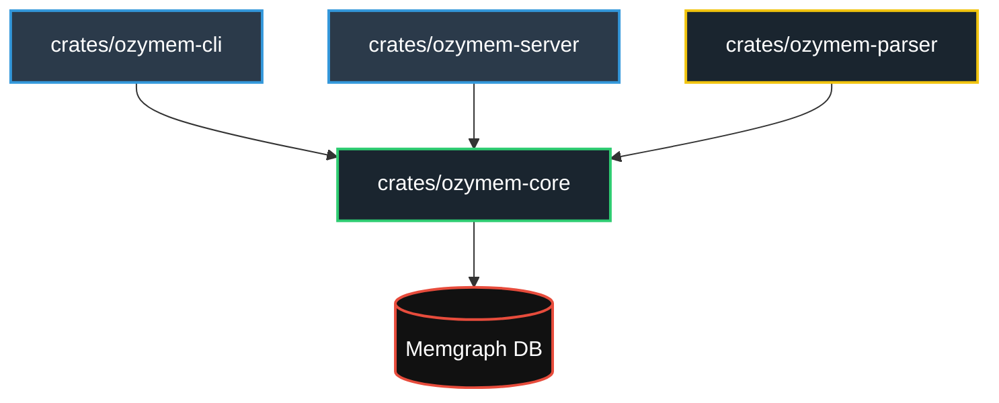

# Ozymem - Guía de Configuración y Requisitos

Ozymem es un motor de análisis arquitectónico políglota y un servidor de engramas de memoria basado en grafos de conocimiento. Utiliza **Memgraph** como base de datos para almacenar y correlacionar relaciones de dependencia, estructuras de funciones y lecciones aprendidas.

---

## 🛠️ Requisitos del Sistema

Para ejecutar y desarrollar con Ozymem, el sistema local debe cumplir con los siguientes requisitos previos:

1. **Rust (Cargo & Rustc)**:
   - Versión estable reciente (probado y verificado con Rust `1.96.0` en este entorno).
   - El ejecutable de Cargo debe estar disponible en la variable `PATH` de la terminal (por defecto en Windows se instala en `%USERPROFILE%\.cargo\bin`).
2. **Docker y Docker Desktop**:
   - Con soporte para `docker compose`.
   - El servicio/daemon de Docker debe estar activo y en ejecución.

---

## 🗂️ Arquitectura del Monorepo

El monorepo está estructurado en 4 crates principales ubicados dentro de la carpeta `crates/`:



* **`crates/ozymem-core`**: Capa lógica de comunicación con la base de datos Memgraph mediante el driver de Bolt `neo4rs`.
* **`crates/ozymem-parser`**: Analizadores sintácticos estructurados para múltiples lenguajes (Rust, Go, Python, JavaScript, TypeScript, SQL) utilizando `tree-sitter`.
* **`crates/ozymem-cli`**: Interfaz de línea de comandos para que los desarrolladores y agentes interactúen con el sistema localmente.
* **`crates/ozymem-server`**: Servidor del Protocolo de Contexto de Modelos (MCP) que se comunica mediante `JSON-RPC` en standard I/O (stdin/stdout).

---

## 🚀 Guía de Inicialización (Windows)

El repositorio incluye un script automatizado `init-ozymem.ps1` en PowerShell. A continuación se detallan los pasos necesarios para inicializar el sistema de forma exitosa.

### Paso 1: Asegurar que Cargo y Docker estén en el PATH y Activos
Asegúrate de que Docker Desktop está abierto y ejecutándose en segundo plano. Para cargar la herramienta `cargo` en la sesión de terminal actual, ejecuta:
```powershell
$env:PATH += ";$env:USERPROFILE\.cargo\bin"
```

### Paso 2: Ejecutar el Script de Inicialización
Abre una terminal PowerShell en el directorio raíz del proyecto y ejecuta:
```powershell
Set-ExecutionPolicy Bypass -Scope Process -Force
.\init-ozymem.ps1
```
Este script:
1. Comprueba las dependencias (Docker y Cargo).
2. Levanta los contenedores de base de datos (`memgraph` en el puerto `7687` y `memgraph-lab` en el puerto `3000` para visualización web) mediante Docker Compose.
3. Compila e instala la CLI global `ozymem` en tu sistema (`cargo install --path crates/ozymem-cli`).

### Paso 3: Registrar el Proyecto en Ozymem
El sistema requiere que los directorios escaneados estén registrados por seguridad. Para registrar el repositorio actual:
```powershell
ozymem register ozymemgraph
```

### Paso 4: Escanear el Proyecto
Una vez registrado, puedes indexar el código fuente del proyecto:
```powershell
ozymem scan .
```

---

## 💻 Comandos Principales de la CLI (`ozymem`)

| Comando | Acción |
| :--- | :--- |
| `ozymem status` | Muestra el estado de la conexión con Memgraph y las estadísticas del grafo (nodos indexados). |
| `ozymem scan <ruta>` | Analiza e indexa los archivos de un directorio. Usa `--reset` para limpiar el grafo antes de escanear, o `--force` si no está registrado. |
| `ozymem register <nombre>`| Registra un nuevo directorio/proyecto autorizado en el archivo de configuración global `~/.ozymem.toml`. |
| `ozymem list` | Muestra todos los proyectos registrados y autorizados. |
| `ozymem tree <archivo>` | Renderiza de forma visual el árbol de dependencias del archivo y sus funciones miembro. |
| `ozymem lessons` | Imprime el historial de lecciones y errores documentados en el grafo. |
| `ozymem watch <ruta>` | Inicia un watcher en vivo que actualiza el grafo ante cualquier creación, modificación o borrado de archivos. |
| `ozymem start <ruta>` | Inicia el watcher en segundo plano guardando logs en `~/.ozymem.log` y registrando el PID en `~/.ozymem.pid`. |
| `ozymem stop` | Detiene el watcher en segundo plano. |

---

## 🤖 Integración del Servidor MCP

Ozymem ofrece un servidor MCP compatible con entornos de IA como Cursor, Claude Desktop o Windsurf.

### Herramientas del Servidor MCP
Cuando el servidor se ejecuta, provee las siguientes herramientas de IA:

1. **`file_context`**:
   - *Parámetros*: `{ "file_path": "string" }`
   - *Retorna*: Los metadatos de un archivo, sus funciones indexadas y los engramas de soluciones históricas asociadas a este archivo.
2. **`graph_summary`**:
   - *Parámetros*: `{}`
   - *Retorna*: Resumen de las métricas del grafo (número de archivos indexados, total de funciones por estrategia de análisis, etc.).
3. **`record_lesson`**:
   - *Parámetros*: `{ "file_path": "string", "error_type": "string", "solution": "string" }`
   - *Retorna*: Confirmación de persistencia de lección aprendida frente a fallos.

### Ejecutar el Servidor MCP
Puedes iniciarlo de forma manual con cargo:
```powershell
cargo run -p ozymem-server
```
O usando el script wrapper preconfigurado que garantiza que Memgraph está activo primero:
```powershell
.\start-ozymem.ps1
```

La consola de Memgraph Lab está expuesta en:
👉 **[http://localhost:3000](http://localhost:3000)** (conéctate usando host `memgraph` y puerto `7687` o directamente `localhost:7687`).
